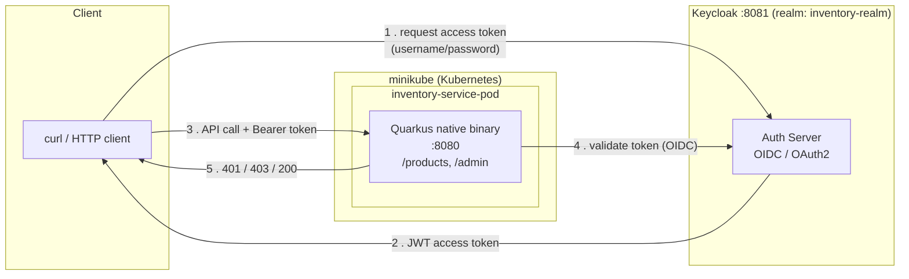
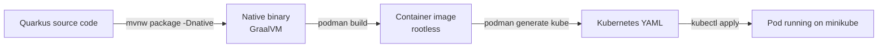

# Podman + Quarkus + Keycloak — Secure Java Microservice

Enterprise-style Java microservice: a Quarkus REST API, containerized with rootless Podman, deployed to Kubernetes (minikube) via `podman generate kube`, and secured with Keycloak OAuth2/OIDC role-based access control.

## Skills demonstrated

- **Quarkus** — Kubernetes-native Java framework, JVM vs native (GraalVM) compilation
- **Podman** — daemonless, rootless container engine
- **Keycloak** — self-hosted SSO / OAuth2 / OIDC identity provider

---

## Architecture



**Request flow**

1. Client authenticates against Keycloak (`inventory-realm`) and gets a JWT access token.
2. Client calls the Quarkus API with `Authorization: Bearer <token>`.
3. `quarkus-oidc` validates the token against Keycloak and checks the caller's realm role.
4. Response:
   - No token → **401 Unauthorized**
   - Valid token, wrong role → **403 Forbidden**
   - Valid token, correct role → **200 OK**

**Build & deploy pipeline**



---

## Repo layout

```
podman-quarkus-keycloak/
├── inventory-service/          Quarkus source (Java + Maven)
│   ├── src/main/java/com/example/
│   │   ├── Product.java
│   │   ├── ProductResource.java   -> /products, /products/{id}
│   │   └── AdminResource.java     -> /admin (admin-only)
│   ├── src/main/resources/application.properties
│   └── Containerfile
├── k8s/
│   └── inventory-service.yaml  Generated via `podman generate kube`
├── STARTUP_COMPARISON.md       JVM vs native startup numbers
├── PODMAN_SECURITY.md          Rootless Podman security evidence
├── KEYCLOAK_SETUP.md           Realm / client / roles / users
├── KEYCLOAK_AUTH_TESTS.md      401 / 403 / 200 test evidence
└── README.md                   This file
```

---

## 1. Environment setup

| Tool | Version used |
|---|---|
| Podman | 5.7.0 (rootless) |
| Java | 17 (OpenJDK) |
| GraalVM CE | 25.3.4 (for native compilation) |
| Quarkus CLI | 3.39.4 |
| Keycloak | 26.0 |
| minikube | 1.39.0 |
| kubectl | 1.37.0 |

```bash
# Podman
sudo apt update && sudo apt install -y podman

# Java 17
sudo apt install -y openjdk-17-jdk
sudo update-alternatives --config java   # select the 17 entry

# Quarkus CLI (via JBang)
curl -Ls https://sh.jbang.dev | bash -s - app install --fresh --force quarkus@quarkusio

# GraalVM CE 25 (native-image) via SDKMAN
curl -s "https://get.sdkman.io" | bash
source "$HOME/.sdkman/bin/sdkman-init.sh"
sdk install java 25.3.4+1.r25-graalce
sdk use java 25.3.4+1.r25-graalce

# kubectl
curl -LO "https://dl.k8s.io/release/$(curl -L -s https://dl.k8s.io/release/stable.txt)/bin/linux/amd64/kubectl"
chmod +x kubectl && sudo mv kubectl /usr/local/bin/

# minikube (already installed) — start it
minikube start --driver=docker
```

---

## 2. Build the Quarkus application

Generate the project:

```bash
quarkus create app com.example:inventory-service \
  --extension=resteasy-reactive,resteasy-reactive-jackson \
  -o inventory-service --no-code
```

`ProductResource.java` exposes two endpoints backed by an in-memory map:

- `GET /products` — list all products
- `GET /products/{id}` — get one product (404 if missing)

```bash
curl -s http://localhost:8080/products | python3 -m json.tool
curl -s http://localhost:8080/products/1 | python3 -m json.tool
curl -i http://localhost:8080/products/99      # -> 404
```

### JVM mode

```bash
./mvnw package
java -jar target/quarkus-app/quarkus-run.jar
```

**Result:** `inventory-service 1.0.0-SNAPSHOT on JVM ... started in 0.418s`

### Native mode (GraalVM)

```bash
./mvnw package -Dnative
./target/inventory-service-1.0.0-SNAPSHOT-runner
```

**Result:** `inventory-service 1.0.0-SNAPSHOT native ... started in 0.022s`

### Startup comparison

| Mode | Startup time | Artifact |
|---|---|---|
| JVM | 0.418s | `quarkus-run.jar` |
| Native | **0.022s** | 42.31 MiB standalone executable |

**Native is ~19x faster to start than JVM mode.** This is Quarkus's core selling point over Spring Boot — sub-30-millisecond startup is ideal for serverless and Kubernetes autoscaling, where cold-start latency directly affects cost and responsiveness.

Full details: [`STARTUP_COMPARISON.md`](./STARTUP_COMPARISON.md)

---

## 3. Containerize with Podman

Quarkus generates a ready-made `Dockerfile.native`, copied to `Containerfile` (Podman/Red Hat naming convention, same syntax):

```bash
cp src/main/docker/Dockerfile.native Containerfile
podman build -f Containerfile -t inventory-service:native .
```

Run and test:

```bash
podman run -d --name inventory-service -p 8080:8080 inventory-service:native
curl -s http://localhost:8080/products | python3 -m json.tool
```

**Result:** `BUILD SUCCESS`, image runs, native startup **0.024s** inside the container.

### Rootless security proof

```bash
podman inspect inventory-service --format '{{.HostConfig.Privileged}}'   # -> false
podman info --format '{{.Host.Security.Rootless}}'                       # -> true
ps -ef | grep application     # process runs as UID 101000, not root (0)
```

**Why rootless Podman beats Docker's default model:**

- Docker runs an always-on root daemon (`dockerd`) — a vulnerability there gives an attacker root on the host.
- Podman has no daemon; each container is a direct child process of the user who launched it (fork/exec).
- Rootless mode uses Linux user namespaces — inside the container the process may look like UID 0, but it's mapped to an unprivileged host UID (e.g. `101000`), so even a full container breakout doesn't grant real host root.
- Smaller attack surface overall — no privileged background service listening on a socket.

Full details: [`PODMAN_SECURITY.md`](./PODMAN_SECURITY.md)

### Deploy to Kubernetes with `podman generate kube`

```bash
mkdir -p k8s
podman generate kube inventory-service > k8s/inventory-service.yaml

# Load the locally-built image into minikube's runtime
podman save inventory-service:native -o inventory-service.tar
minikube image load inventory-service.tar

# imagePullPolicy: Never so k8s uses the loaded image instead of pulling
kubectl apply -f k8s/inventory-service.yaml
kubectl get pods
```

**Result:**

```
NAME                    READY   STATUS    RESTARTS   AGE
inventory-service-pod   1/1     Running   0          18s
```

Verified via port-forward:

```bash
kubectl port-forward pod/inventory-service-pod 8080:8080 &
curl -s http://localhost:8080/products | python3 -m json.tool
```

`podman generate kube` — a Podman-only feature with no Docker equivalent — turned a running container directly into a deployable Kubernetes manifest, no manual YAML authoring required.

---

## 4. Authentication with Keycloak

### Setup

```bash
podman run -d --name keycloak --network host \
  -e KEYCLOAK_ADMIN=admin \
  -e KEYCLOAK_ADMIN_PASSWORD=admin \
  -e KC_HTTP_PORT=8081 \
  quay.io/keycloak/keycloak:26.0 \
  start-dev
```

In the admin console (`http://localhost:8081`):

- Realm: `inventory-realm`
- Client: `inventory-service` (confidential — client authentication ON, direct access grants ON)
- Realm roles: `admin`, `user`
- Users: `adminuser` (role `admin`) and `normaluser` (role `user`)

Full details: [`KEYCLOAK_SETUP.md`](./KEYCLOAK_SETUP.md)

### Quarkus integration

```bash
./mvnw quarkus:add-extension -Dextensions="oidc"
```

`application.properties`:

```properties
quarkus.oidc.auth-server-url=http://localhost:8081/realms/inventory-realm
quarkus.oidc.client-id=inventory-service
quarkus.oidc.credentials.secret=<client-secret>
quarkus.oidc.application-type=service

quarkus.http.auth.permission.authenticated.paths=/products,/products/*
quarkus.http.auth.permission.authenticated.policy=authenticated

quarkus.http.auth.permission.admin.paths=/admin/*
quarkus.http.auth.permission.admin.policy=admin-policy
quarkus.http.auth.policy.admin-policy.roles-allowed=admin
```

- `/products/*` — any authenticated user (role `user` or `admin`)
- `/admin/*` — only users with the `admin` realm role

### Authorization test evidence

**Test 1 — no token → 401**

```bash
curl -i http://localhost:8080/products
curl -i http://localhost:8080/admin
```
→ both return `HTTP/1.1 401 Unauthorized`

**Test 2 — valid token, wrong role (`normaluser`, role=`user`) → 403 on `/admin`**

```bash
curl -i http://localhost:8080/admin    -H "Authorization: Bearer $TOKEN"   # -> 403 Forbidden
curl -i http://localhost:8080/products -H "Authorization: Bearer $TOKEN"   # -> 200 OK
```

**Test 3 — valid token, correct role (`adminuser`, role=`admin`) → 200**

```bash
curl -i http://localhost:8080/admin -H "Authorization: Bearer $ADMIN_TOKEN"
```
→ `HTTP/1.1 200 OK`
```json
{"message": "Hello Admin! This is a protected admin-only endpoint."}
```

| Scenario | Endpoint | Expected | Result |
|---|---|---|---|
| No token | `/products`, `/admin` | 401 | ✅ 401 |
| `user` role | `/admin` | 403 | ✅ 403 |
| `user` role | `/products` | 200 | ✅ 200 |
| `admin` role | `/admin` | 200 | ✅ 200 |

Full details: [`KEYCLOAK_AUTH_TESTS.md`](./KEYCLOAK_AUTH_TESTS.md)

---

## Why this combo matters

Quarkus, Podman, and Keycloak are common in enterprise Java shops (banks, insurance, telecom) built on the Red Hat ecosystem. This project gives concrete, hands-on answers to the interview question *"why would you use Quarkus over Spring Boot?"* (sub-second/native startup), *"why Podman over Docker?"* (rootless, daemonless security model), and *"how do you secure microservices?"* (OIDC + role-based access control with verified 401/403/200 behavior).
